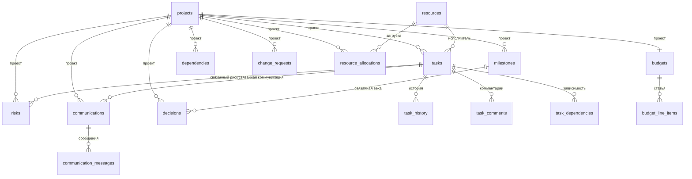

# Словарь данных

Основной табличный слой датасета лежит в `data/*.csv` и описывает портфель из 6 проектов. Вспомогательные события лежат в `data/control_events.jsonl`, а проектные паспорта и результаты парсинга - в `data/project_documents/` и `data/per_file_json/`. Заголовки CSV и события русифицированы; технические имена файлов, идентификаторы строк и общепринятые аббревиатуры вроде `MAX2.0`, `CRM`, `PCI DSS`, `Android/iOS` оставлены как стабильные входные обозначения. При загрузке в БД русские заголовки сопоставляются с внутренними полями моделей.

В CSV хранятся только входные факты, которые можно получить на текущий момент по проекту. Расчетные показатели, прогнозы, зоны риска и агрегаты считаются приложением поверх этих фактов.

## Объем датасета

| Файл | Строк данных | Суть |
| --- | ---: | --- |
| `projects.csv` | 6 | Карточки проектов портфеля |
| `tasks.csv` | 154 | Операционные задачи из трекера задач |
| `task_history.csv` | 22 | История изменений задач |
| `task_comments.csv` | 22 | Комментарии по задачам |
| `task_dependencies.csv` | 16 | Связи задач и критический путь |
| `milestones.csv` | 24 | Проектные вехи |
| `budgets.csv` | 6 | Бюджетные факты по проектам |
| `budget_line_items.csv` | 24 | Статьи бюджета |
| `risks.csv` | 24 | Реестр рисков |
| `communications.csv` | 26 | Коммуникации и согласования |
| `communication_messages.csv` | 52 | Сообщения внутри коммуникаций |
| `resources.csv` | 32 | Справочник специалистов |
| `resource_allocations.csv` | 49 | Загрузка специалистов по проектам |
| `dependencies.csv` | 12 | Внешние и межкомандные зависимости |
| `decisions.csv` | 8 | Управленческие решения |
| `change_requests.csv` | 7 | Запросы на изменение |
| `control_events.jsonl` | 5 | События для симуляции проектного контроля |

MAX2.0 сокращен до размера, сопоставимого с остальными проектами: 24 задачи, 8 ресурсов, 4 вехи, 4 статьи бюджета, 4 риска, 4 коммуникации, 2 решения и 2 запроса на изменение.

## Таблицы

### `projects.csv`

Карточки проектов. Поля: идентификатор, название, жизненный статус, приоритет, дата старта, плановая дата окончания, бизнес-цель, ожидаемый результат, бизнес-ценность.

Важно: жизненный статус является входным фактом о состоянии карточки проекта. Он не заменяет вычисляемый уровень риска и не является готовой метрикой здоровья проекта.

### `tasks.csv`

Задачи проекта из трекера задач. Поля: идентификатор, идентификатор проекта, внешний идентификатор, заголовок, исполнитель, статус, приоритет, плановый срок, фактическая дата завершения, оценка часов, затраченные часы, признак блокировки, причина блокировки.

Используется для расчета просрочек, блокировок, трудозатрат, загрузки команд и списка задач, требующих внимания. Сама таблица не хранит количество просрочек, отклонение от плана или итоговую оценку риска.

### `task_history.csv`

История изменений задач. Поля: задача, время изменения, измененное поле, старое значение, новое значение, кем изменено, система-источник.

Значение `измененное_поле` в CSV русское, а загрузчик переводит его во внутренний служебный код. Таблица нужна для поиска событий: постановка задачи в блокировку, перенос срока, рост оценки часов, смена исполнителя.

### `task_comments.csv`

Комментарии и обсуждения по задачам. Поля: задача, автор, время создания, канал, текст, количество упоминаний, система-источник.

Используется как фактический слой коммуникаций вокруг задач: причины блокировок, открытые вопросы, признаки конфликта и материал для проектной сводки.

### `task_dependencies.csv`

Связи между задачами. Поля: задача, задача-предшественник, тип зависимости, признак критического пути, лаг в днях, причина.

Позволяет объяснять задержки через зависимые работы и строить цепочки влияния без хранения заранее посчитанной длительности критического пути.

### `dependencies.csv`

Зависимости проекта от команд, систем, вендоров и управленческих решений. Поля: тип зависимости, объект зависимости, команда-владелец, ожидаемая дата, статус, критичность, связанная задача.

Нужна, чтобы отделить факт внешней зависимости от вычисляемого риска по этой зависимости.

### `decisions.csv`

Управленческие решения по проектам. Поля: дата решения, тип решения, описание, владелец решения, статус, связанная веха.

Показывает, какие решения уже согласованы, ожидают реакции или находятся на рассмотрении.

### `change_requests.csv`

Запросы на изменение бюджета, сроков или объема работ. Поля: дата запроса, инициатор, тип изменения, описание, запрошенное изменение бюджета, запрошенное изменение срока в днях, статус.

Таблица хранит только запрошенные изменения. Суммарное влияние открытых запросов и влияние на прогноз затрат считаются в приложении.

### `milestones.csv`

Вехи проектов. Поля: название, плановые и фактические даты начала и окончания, статус, ответственная команда.

Используется для оценки хода реализации и сдвига сроков. Итоговая задержка проекта в CSV не хранится.

### `budgets.csv`

Бюджетные факты по каждому проекту. Поля: плановый бюджет, фактические затраты, ожидаемый экономический эффект, стоимость дня задержки, валюта.

Прогноз итоговых затрат, отклонение бюджета и экономическая эффективность считаются отдельно.

### `budget_line_items.csv`

Детализация бюджета по статьям. Поля: проект, бюджет, категория, название статьи, плановая сумма, фактическая сумма, команда-владелец.

Помогает объяснить, по каким статьям формируются фактические затраты и прогноз бюджета.

### `risks.csv`

Реестр рисков. Поля: тип риска, описание, вероятность, влияние, ответственный, план снижения риска, статус, связанная задача.

Таблица хранит экспертные входные оценки вероятности и влияния. Интегральный риск, уровень риска и приоритет внимания считаются приложением.

### `communications.csv`

Карта коммуникаций и согласований. Поля: команда-отправитель, команда-получатель, тема, канал, дата последнего сообщения, ожидаемая дата ответа, статус, важность, связанная задача.

Используется для поиска зависших согласований и коммуникационных задержек.

### `communication_messages.csv`

Сообщения внутри коммуникационных потоков. Поля: время сообщения, автор, адресат, канал, тип сообщения, статус, краткое содержание, связанная задача, признак эскалации.

Дает аудит фактической переписки и основание для объяснения статуса коммуникации.

### `resources.csv`

Справочник специалистов. Поля: ФИО, роль, команда, доступная недельная емкость, часовая ставка, уровень специалиста.

Используется для расчета загрузки, стоимости и распределения специалистов между проектами.

### `resource_allocations.csv`

Плановая и фактическая загрузка ресурсов по проектам. Поля: ресурс, проект, план часов в неделю, факт часов в неделю.

Таблица хранит входные часы. Перегрузка ресурса и отклонение загрузки считаются приложением.

## Связи

## Что не хранится в CSV

Эти показатели намеренно вычисляются в коде, а не хранятся в исходных данных:

- количество просроченных задач;
- количество заблокированных задач;
- дни задержки;
- отклонение бюджета;
- прогноз итоговых затрат;
- рентабельность инвестиций;
- интегральная оценка риска;
- перегрузка ресурсов;
- задержка коммуникаций;
- количество рискованных зависимостей;
- количество ожидающих решений;
- суммарное влияние запросов на изменение;
- оценка здоровья проекта;
- уровень риска проекта;
- снимки метрик;
- журнал расчетных событий.

Идея кейса: приложение и аналитический слой должны собирать смысл из чистых входных таблиц, а не читать заранее посчитанные метрики из датасета.
