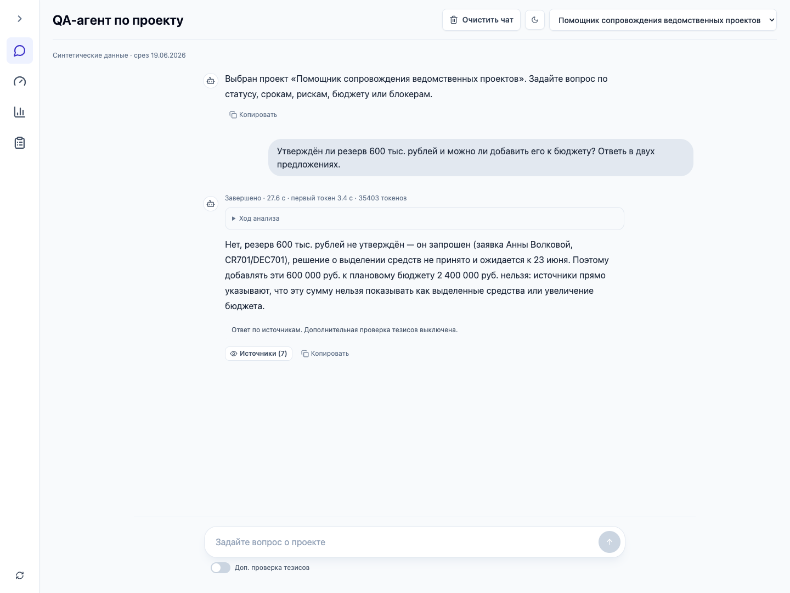
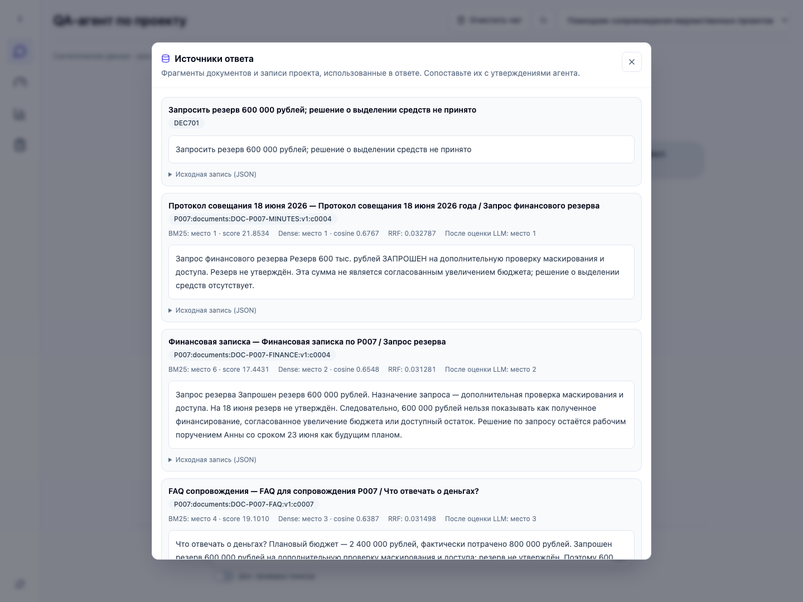
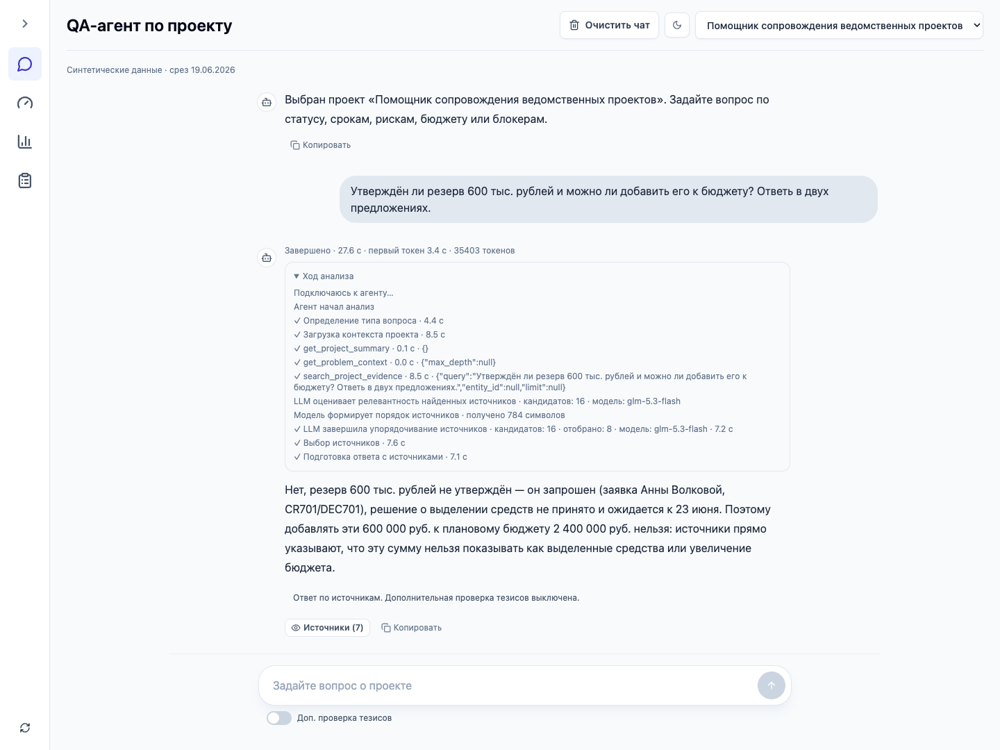
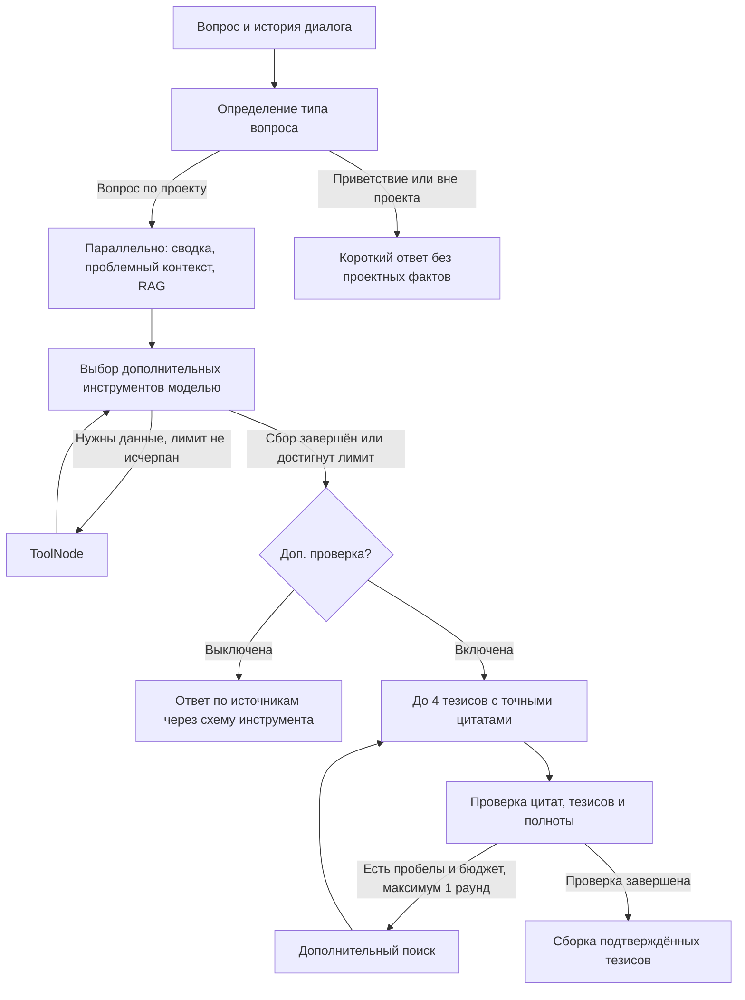

<p align="center">
  
</p>

<h1 align="center">Project QA</h1>

<p align="center">
  <strong>Знания проекта. Ответы с источниками.</strong><br>
  AI-агент для поиска по документам, перепискам и данным проекта.
</p>

<p align="center">
  <a href="https://github.com/Monyzik/sdm-hack/actions/workflows/ci.yml"></a>
  
  
  
  
  
</p>

<p align="center">
  <a href="#быстрый-запуск">Быстрый запуск</a> ·
  <a href="#стек">Стек</a> ·
  <a href="#архитектура">Архитектура</a> ·
  <a href="docs/METRICS.md">Метрики</a> ·
  <a href="data/interview/README.md">Датасет</a>
</p>

---

**Project QA** помогает сотруднику сопровождения проверить решение, найти блокер
и подготовить ответ по фактам. Один LangGraph-агент объединяет гибридный поиск,
14 инструментов и дополнительную проверку тезисов. Источники и ход выполнения
доступны рядом с ответом.



## Возможности

| Возможность | Как работает |
| --- | --- |
| **Вопросы по проекту** | Сроки, задачи, риски, решения, бюджет и обучение; история диалога помогает понять уточнения |
| **Гибридный RAG** | Поиск по смыслу и словам: embeddings + BM25 → RRF → LLM-реранкинг |
| **Инструменты агента** | Модель задаёт поисковые запросы, читает соседние фрагменты, обращается к таблицам и считает стоимость задержки |
| **Источники ответа** | Текст, документ, версия и результаты ранжирования доступны для сопоставления с утверждением |
| **Проверка тезисов** | Отдельный режим проверяет цитаты и утверждения, исключает неподтверждённое и при необходимости запускает дополнительный поиск |
| **Наблюдаемость** | SSE показывает этапы, аргументы инструментов, время, токены и результат реранкинга |

Документы и таблицы доступны в одном интерфейсе. Агент различает план и факт,
запрос и утверждённое решение, сопоставляет редакции источников.

<details>
<summary>Посмотреть источники и ход выполнения</summary>

Источники показывают текст, ID документа и версии, места в BM25 и dense, оценку RRF
и итоговое место после LLM-реранкинга.



Панель «Ход анализа» показывает события выполнения и измеренные длительности этапов.



</details>

## Стек

| Слой | Технологии | Назначение |
| --- | --- | --- |
| **Агент** | Python · LangGraph · LangChain Core | Граф состояний, ToolNode и управление вызовами инструментов |
| **API и контракты** | FastAPI · Pydantic · HTTPX · SSE | HTTP API, схемы аргументов и ответов, поток событий |
| **Данные** | PostgreSQL 16 · pgvector · SQLAlchemy · asyncpg | Таблицы проекта, векторы и асинхронный доступ к БД |
| **Поиск** | Qwen3-Embedding-8B · BM25 · RRF | Dense- и лексический поиск с объединением рангов |
| **LLM** | GLM-5.3-Flash · OpenAI-совместимый API | Выбор инструментов, реранкинг, ответы и проверка тезисов |
| **Интерфейс** | React 19 · TypeScript · Vite · Tailwind CSS · TanStack Query | Чат, источники и просмотр данных проекта |
| **Оценка качества** | Pandas · pytest · Ruff | Эксперименты, CSV/HTML-отчёты и offline-проверки |
| **Окружение** | Docker Compose · GitHub Actions | Запуск сервисов, тесты, линтеры и сборка в CI |

Генерация и embeddings используют независимые URL, ключи и model ID.
В демке GLM подключена через Z.ai, Qwen3-Embedding-8B — через Polza.

## Быстрый запуск

Нужны Git, Docker с Compose и два ключа: для генерации с tool calling и для embeddings.

```bash
git clone https://github.com/Monyzik/sdm-hack.git
cd sdm-hack
cp .env.example .env
```

В `.env` заполните `LLM_API_KEY` и `EMBEDDING_API_KEY`, а также URL и model ID.
Ниже конфигурация, использованная в локальной демке; доступность моделей зависит от
вашего аккаунта у провайдера:

```dotenv
LLM_BASE_URL=https://api.z.ai/api/coding/paas/v4
LLM_MODEL=glm-5.3-flash
LLM_RESPONSE_FORMAT=tool_calling
LLM_SEND_TEMPERATURE=false
LLM_REASONING_EFFORT=low
LLM_THINKING_MODE=enabled
LLM_TOOL_STREAM=true

EMBEDDING_BASE_URL=https://polza.ai/api/v1
EMBEDDING_MODEL=qwen/qwen3-embedding-8b
EMBEDDING_DIMENSIONS=4096
```

Провайдеры независимы: генерации нужен OpenAI-совместимый `/chat/completions`,
эмбеддингам — `/embeddings`. Реранкер использует основную LLM. При смене провайдера
проверьте поддержку необязательных параметров thinking и streaming.
Остальные параметры и пояснения — в [.env.example](.env.example).

Запустите сервисы, загрузите подготовленные CSV и постройте индекс:

```bash
docker compose up -d --build

# Дождитесь успешного ответа обоих сервисов.
curl --fail http://localhost:8000/health
curl --fail http://localhost:8010/health

# Для пустой базы, выполнить один раз.
docker compose exec agents python -m scripts.load_demo_data_to_db

# Индексация вызывает API эмбеддингов и может занять несколько минут.
curl --fail -X POST \
  http://localhost:8000/api/v1/summaries/projects/P007/retrieval-index
```

Откройте **[localhost:5180](http://localhost:5180)**. Выберите P007 и задайте вопрос.
Переключатель **«Доп. проверка тезисов»** находится под полем ввода и по умолчанию выключен.

| Сервис | Адрес |
| --- | --- |
| Интерфейс | http://localhost:5180 |
| API данных / Swagger | http://localhost:8000/docs |
| API агента / Swagger | http://localhost:8010/docs |

Если порт PostgreSQL занят, задайте `POSTGRES_PORT=5433` и тот же порт в хостовом
`DATABASE_URL`. Внутри Docker `DATABASE_URL_DOCKER` продолжает использовать `postgres:5432`.

Для обновления старой синтетической базы предусмотрен импорт
`python -m scripts.load_demo_data_to_db --replace-demo` внутри контейнера `agents`.
Он заменяет известные P001–P007 в одной транзакции и отказывается работать при чужих
project ID. Перед заменой сохраните резервную копию. Повторите индексацию после
изменения корпуса или embedding-конфигурации; код контейнеров обновляется через
`docker compose up -d --build`.

## Архитектура



Обязательный поиск гарантирует граф. Для дальнейших запросов модель использует
14 инструментов из [реестра](sdm/agents/tools/registry.py). Аргументы и структурированные
ответы задаются схемами и проверяются Pydantic. Для поддерживающих провайдеров доступен
`LLM_RESPONSE_FORMAT=json_schema`.

RAG разбивает Markdown и DOCX по разделам на фрагменты до 1200 символов с перекрытием
до 150. ID сохраняет документ, версию и номер фрагмента. PostgreSQL с pgvector хранит
4096-мерные embeddings; dense использует точный cosine search. BM25 независимо
ранжирует допустимые фрагменты. Два списка до 60 кандидатов объединяются через
**RRF(k=60) → top-16 → GLM → top-8**. При сбое реранкера сохраняется порядок RRF.
Фильтры проекта, даты и embedding-профиля применяются до отбора кандидатов.

| Режим ответа | Что происходит | Статус |
| --- | --- | --- |
| Обычный, по умолчанию в UI | Ответ по найденным источникам, ID ссылок ограничены схемой | `not_checked` |
| Дополнительная проверка | Точные цитаты, отдельная проверка тезисов, оценка полноты, при необходимости один дополнительный поиск | `passed`, `partial`, `abstained`, `unavailable` |

Проверки используют ту же LLM и могут ошибаться. `passed` означает, что проверка
подтвердила тезисы по доступным данным. Это не гарантия истинности или полноты корпуса.
В обоих режимах SSE передаёт прогресс; текст ответа публикуется после финализации
выбранной ветки. Сырые рассуждения модели по умолчанию скрыты.

## Данные и измерения

Демо использует синтетический проект P007 «Помощник сопровождения ведомственных
проектов», срез — **19 июня 2026 года**. Все люди, организации и события вымышлены.

**150 документов / 162 файла с версиями, 216 сообщений, 80 комментариев, 16 задач,
769 индексируемых фрагментов и записей.** Корпус содержит похожие коды, противоречивые
редакции, неподтверждённые решения и вопросы, на которые сведений недостаточно.

| Материал | Путь |
| --- | --- |
| Документы и версии | [manifest.json](data/interview/manifest.json), [коллекции](data/interview/collection/) |
| Переписки и комментарии | [conversations.json](data/interview/conversations.json), [task-comments.json](data/interview/task-comments.json) |
| Сценарий и таблицы | [scenario.json](data/interview/scenario.json), [data/demo](data/demo/) |
| 300 вопросов и разбиение | [eval_cases.jsonl](data/interview/eval_cases.jsonl), [eval_splits.json](data/interview/eval_splits.json) |
| Точные цитаты для новых случаев | [evidence_map.json](data/interview/collection/evidence_map.json) |

Последний retrieval-прогон: 120 новых вопросов E181–E300 на корпусе v3;
Recall оценивался на 113 вопросах, MRR — на 64.

| Поиск | Recall@8 | MRR | p50 / p95 |
| --- | ---: | ---: | ---: |
| Dense | 0.9142 | 0.8626 | 0.55 / 6.75 с |
| Hybrid + LLM-реранкер | **0.9646** | **0.9531** | 7.07 / 17.09 с |

Синтетическая предварительная разметка, до трёх параллельных процессов. Два таймаута
реранкера с переходом на RRF включены в результаты. Это метрики поиска, а не точность
готовых ответов; прежние 180 вопросов в этом прогоне не переоценивались.
Подробности, исходные результаты и датасеты: [METRICS.md](docs/METRICS.md).

В паре отдельных запросов «При каких условиях можно начать пилот?» обычный режим
занял **32.94 с / 4 LLM-вызова**, дополнительная проверка — **101.87 с / 15 вызовов**.
Это два наблюдения, не средняя производительность. Отчёты и ограничения:
[METRICS.md](docs/METRICS.md).
Токены в интерфейсе — сумма входных и выходных токенов всех LLM-вызовов запроса.
Показатель «первый токен» сейчас относится к первой LLM-операции, а не к началу
пользовательского ответа.

## Проверки и воспроизведение оценки

Для локальной разработки нужны Python 3.11+ и Node.js 22. Из корня репозитория:

```bash
python3 -m venv .venv
source .venv/bin/activate
python -m pip install -r requirements-dev.txt
PYTEST_DISABLE_PLUGIN_AUTOLOAD=1 python -m pytest -q
python -m ruff check sdm tests scripts
python -m ruff check --select I sdm/agents tests/agents
python -m ruff format --check sdm/agents tests/agents
npm --prefix frontend ci
npm --prefix frontend run lint
npm --prefix frontend run build
```

268 offline-тестов проверяют граф, инструменты, схемы, цитаты, восстановление после
ошибок, SSE, retrieval и разметку корпуса. [CI](.github/workflows/ci.yml) выполняет
тесты, линтеры и сборку без внешних API. Качество модели оценивается отдельными прогонами.

С запущенными сервисами и готовым индексом:

```bash
# Отложенный набор: поиск, без генерации QA-ответов.
python -m sdm.evaluation --dataset data/interview/eval_holdout.jsonl \
  --retrieval-modes dense bm25 hybrid hybrid_rerank --skip-qa \
  --output outputs/evaluations/heldout-new-run

# Один QA-кейс с дополнительной проверкой тезисов.
python -m sdm.evaluation --dataset data/interview/eval_cases.jsonl \
  --case-id E021 --output outputs/evaluations/qa-e021-new-run
```

Выходной каталог должен быть новым. Прогоны обращаются к внешним API.
Runner создаёт `raw.jsonl`, `metadata.json`, `summary.csv`, `report.html` и
`manual_review.csv`; Pandas формирует таблицы и отчёты. QA runner не передаёт
`verify_claims` и использует API-default `true`, тогда как UI по умолчанию отправляет
`false`. При ручной оценке проверьте поддержку каждого факта источником, полноту
ответа, правильность ссылок и отказ от выдуманных сведений. Наличие ссылки само
по себе не подтверждает утверждение. Разметка синтетическая и требует независимой
человеческой проверки. Формулы и результаты — в [метриках](docs/METRICS.md).

Для воспроизведения CSV без изменения текущей базы:

```bash
python -m scripts.generate_interview_data --output-dir /tmp/p007-csv
```

## Вопросы для демонстрации

| Запрос | Что показать |
| --- | --- |
| При каких условиях можно начать пилот? | Маскирование, матрица доступа, владельцы и источники |
| Утверждён ли резерв 600 тыс. рублей и можно ли добавить его к бюджету? | Запрос отличается от согласованного финансирования |
| Как менялась раскладка будущих обращений между 16 и 18 июня? | Сопоставление редакций без выдуманного утверждения плана |
| Кто подписал промышленный ввод? | Отсутствие подтверждения, без выдуманного подписанта |
| Оцени стоимость задержки на 3 рабочих дня с учётом текущей загрузки ресурсов. | Вызов расчётного инструмента, основания и ограничения оценки |

Для короткой демонстрации начните без проверки тезисов. Затем повторите один и тот же
вопрос с включённой проверкой и сравните этапы, статус ответа и время.

## API

```bash
curl --fail -N http://localhost:8010/api/v1/agents/projects/P007/ask/stream \
  -H 'Content-Type: application/json' \
  -d '{"question":"Утверждён ли резерв 600 тыс. рублей?","as_of":"2026-06-19","verify_claims":false}'
```

Тот же JSON принимает `POST /api/v1/agents/projects/P007/ask` без SSE.
Общий бюджет запроса по умолчанию — 180 секунд. Финальное событие содержит ответ,
источники, статус проверки и метрики; ошибки провайдера возвращаются отдельным событием.

## Структура репозитория

```text
sdm/
  agents/
    project_qa/       граф, узлы, промпты, контракты и проверка подтверждений
    tools/
      project/       задачи, бюджет, риски, решения и коммуникации
      retrieval/     поиск, чтение контекста и LLM-реранкер
    llm/             настройки провайдера, HTTP-клиент и поток модели
    routes/          HTTP и SSE API агента
  backend/
    api/             API данных и индексации
    services/        чтение таблиц, метрики, ingestion, retrieval и embeddings
  evaluation/        запуск оценки, агрегация Pandas и отчёты
frontend/            React, TypeScript, Tailwind, TanStack Query
scripts/             генерация синтетики и загрузка CSV
data/                исходные таблицы, документы и разметка
tests/               offline-тесты
docs/                метрики, артефакты экспериментов и изображения
infra/postgres/      схема PostgreSQL и pgvector
```

## Границы прототипа

Приложение предназначено для локальной демонстрации: нет авторизации, ACL и
долговременной памяти, frontend работает через Vite. `project_id` ограничивает область
поиска, но не заменяет проверку доступа. История чата хранится в браузере и передаётся
модели в сокращённом виде. Даты ограничивают публикации и события; CSV со статусами
не восстанавливают полную историю проекта.

BM25 пересчитывается на небольшом корпусе, ANN-индекса нет. Реранкер и проверка тезисов
увеличивают задержку и расход токенов. Отдельная проверка может ошибочно отклонить
верное утверждение. Экономический эффект и качество на реальных клиентских данных
не измерялись.
